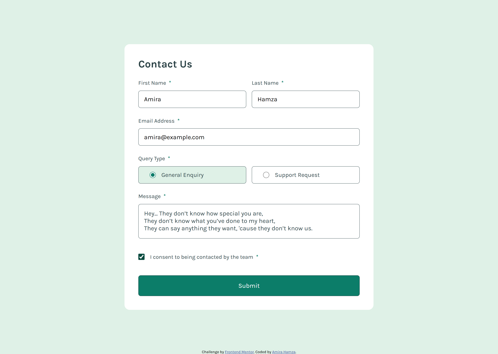

# Frontend Mentor - Contact form solution

This is a solution to the [Contact form challenge on Frontend Mentor](https://www.frontendmentor.io/challenges/contact-form--G-hYlqKJj). Frontend Mentor challenges help you improve your coding skills by building realistic projects.

## Table of contents

- [Frontend Mentor - Contact form solution](#frontend-mentor---contact-form-solution)
  - [Table of contents](#table-of-contents)
    - [The challenge](#the-challenge)
    - [Screenshot](#screenshot)
    - [Links](#links)
    - [Built with](#built-with)
    - [What I learned](#what-i-learned)
    - [Continued development](#continued-development)
  - [Author](#author)
  - [Acknowledgments](#acknowledgments)

### The challenge

Users should be able to:

- Complete the form and see a success toast message upon successful submission
- Receive form validation messages if:
  - A required field has been missed
  - The email address is not formatted correctly
- Complete the form only using their keyboard
- Have inputs, error messages, and the success message announced on their screen reader
- View the optimal layout for the interface depending on their device's screen size
- See hover and focus states for all interactive elements on the page

### Screenshot





### Links

- Solution URL: [Add solution URL here](https://your-solution-url.com)
- Live Site URL: [Add live site URL here](https://your-live-site-url.com)

### Built with

- Semantic HTML5 markup
- CSS custom properties
- Flexbox
- Responsive design
- Javascript

### What I learned

This is my first lone project working with JavaScript and because of that I was a little afraid to start so I put it off for the longest time, it was a challenge but it was fun too. I think I spent the most time trying to get the background color of the query input to change when checked using js. I ended up finding a css solution but it's not supported on firefox apparently. But at this point, I don't even care, sorry, firefox.

Heres the css:

```css
.query-type:has(input:checked) {
  background-color: #dff1e7;
}
```

A one-liner too, I know.

### Continued development

Note to self: I should review the starter pack before diving in. As I was finishing this project, I mistakenly clicked on the images folder instead of the design folder and there I found all the icons I had been looking.

## Author

- Frontend Mentor - [@AmiraxHamza](https://www.frontendmentor.io/profile/AmiraxHamza)

## Acknowledgments

Thank you Quincy Larson!
